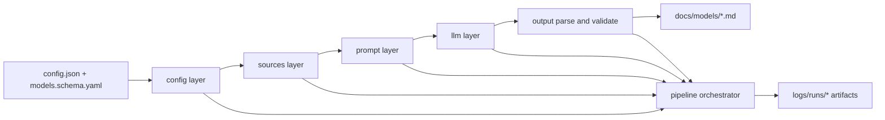

# models-pipeline


LLM-based model catalog generation pipeline for building normalized markdown outputs from local files and web sources. The project reads configured sources, optionally summarizes external pages, prompts provider-backed LLMs, and validates/writes a strict output set for model catalogs and derived views.

Primary references:
- [.github/copilot-instructions.md](.github/copilot-instructions.md)
- [docs/models/models.md](docs/models/models.md)
- [models.schema.yaml](models.schema.yaml)
- [config.json](config.json)

## Project Name and Description

Project: models-pipeline

Purpose:
- Generate and maintain model documentation artifacts such as:
  - [docs/models/models.catalog.copilot.md](docs/models/models.catalog.copilot.md)
  - [docs/models/models.catalog.opencode.md](docs/models/models.catalog.opencode.md)
  - [docs/models/models.lifecycle.md](docs/models/models.lifecycle.md)
  - [docs/models/models.views.md](docs/models/models.views.md)
- Enforce output contracts through structured parsing and validation.
- Provide a check mode to validate generated outputs without writing changes.

## Technology Stack

Core stack:
- Python >= 3.14
- Build and dependency tooling: uv + hatchling
- Testing and QA: pytest, pyright, ruff, ufmt, vulture

LLM and data integrations (as documented in [.github/copilot-instructions.md](.github/copilot-instructions.md)):
- openai == 2.29.0
- anthropic == 0.86.0
- google-genai == 1.68.0
- crawl4ai == 0.8.5
- markdownify == 1.2.2
- python-dotenv == 1.2.2
- python-toon == 0.1.3

Project metadata source:
- [pyproject.toml](pyproject.toml)

## Project Architecture

The repository follows a layered modular monolith. Responsibilities are grouped by package boundary:

- [src/models_pipeline/config](src/models_pipeline/config): config parsing, coercion, schema validation
- [src/models_pipeline/sources](src/models_pipeline/sources): source parser abstractions, registry-driven source handling
- [src/models_pipeline/crawl](src/models_pipeline/crawl): crawl4ai fetching and markdown extraction
- [src/models_pipeline/prompt](src/models_pipeline/prompt): system/user prompt construction
- [src/models_pipeline/llm](src/models_pipeline/llm): provider routing, backend adapters, retry execution
- [src/models_pipeline/output](src/models_pipeline/output): JSON extraction, parse and validate, output writing/checking
- [src/models_pipeline/pipeline](src/models_pipeline/pipeline): end-to-end orchestration and run artifact logging
- [src/models_pipeline/cli.py](src/models_pipeline/cli.py) and [src/models_pipeline/__main__.py](src/models_pipeline/__main__.py): CLI entrypoints



## Getting Started

### Prerequisites

- Python 3.14+
- uv installed
- API key for the configured provider (for default config, OpenAI-compatible key)

### Install

```bash
make setup
```

Equivalent manual steps:

```bash
uv sync
uv run crawl4ai-setup
```

### Configure

Update source and model settings in:
- [config.json](config.json)

Set credentials before generation/check:

```bash
export OPENAI_API_KEY="<your-key>"
```

### Run

Generate outputs:

```bash
make run
```

Validate outputs only (no writes):

```bash
make check
```

CLI examples:

```bash
uv run models-pipeline --sources config.json
uv run models-pipeline --sources config.json --check
uv run models-pipeline --sources config.json --model "openai/gpt-5.4"
```

## Project Structure

Top-level structure:

- [src/models_pipeline](src/models_pipeline): application source
- [tests](tests): unit and orchestration tests
- [docs/models](docs/models): generated and source model documentation
- [logs/runs](logs/runs): run artifacts, prompts, and outputs
- [models.schema.yaml](models.schema.yaml): model schema/contract
- [config.json](config.json): source and output pipeline configuration
- [Makefile](Makefile): common dev and QA commands

## Key Features

- Registry-driven source parsing for configurable source types
- Optional source summarization before final generation
- Prompt builders that return strict system/user prompt pairs
- Multi-provider LLM routing and retry behavior
- Strict output pipeline: JSON extraction -> parse -> validate -> write/check
- Run diagnostics with structured artifacts under [logs/runs](logs/runs)
- Generated lifecycle and recommendation views from normalized catalogs

## Development Workflow

Typical workflow:

1. Update inputs in [config.json](config.json) and source docs.
2. Run generation with make run.
3. Validate with make check.
4. Run quality gates with make qa.

Useful commands:

```bash
make test
make lint
make typecheck
make format
make qa
```

Branching strategy is not explicitly documented in repository guidance; use your team standard if applicable.

## Coding Standards

Standards are defined primarily in [.github/copilot-instructions.md](.github/copilot-instructions.md):

- Use absolute imports rooted at models_pipeline
- Prefer frozen dataclasses for immutable DTO/config objects
- Keep type hints on public APIs and important helpers
- Use ValueError for invalid input/contract violations and RuntimeError for runtime failures
- Prefer pathlib.Path and explicit utf-8 file encoding
- Keep package boundaries intact (config/sources/crawl/prompt/llm/output/pipeline)
- Preserve strict prompt/output contracts and allowed output naming

## Testing

Testing approach:

- Framework: pytest
- Style: function-based tests with fixtures such as tmp_path and monkeypatch
- Focus: deterministic unit tests and orchestration flow assertions

Run tests:

```bash
make test
```

Run a file or a single case:

```bash
make test-file TEST=tests/pipeline/test_pipeline_run_session.py
make test-case TEST=tests/pipeline/test_pipeline_run_session.py::test_name
```

Quality checks:

```bash
make lint
make typecheck
make qa
```

## Contributing

Contribution guidelines:

1. Follow repository conventions in [.github/copilot-instructions.md](.github/copilot-instructions.md).
2. Keep changes inside existing package boundaries.
3. Add or update tests near the affected module area in [tests](tests).
4. Run make qa before opening a PR.
5. Update docs/config contracts when behavior changes:
   - [models.schema.yaml](models.schema.yaml)
   - [config.json](config.json)

Implementation examples are available throughout:
- [src/models_pipeline/pipeline/run_session.py](src/models_pipeline/pipeline/run_session.py)
- [src/models_pipeline/output/parser.py](src/models_pipeline/output/parser.py)
- [tests/pipeline/test_pipeline_run_session.py](tests/pipeline/test_pipeline_run_session.py)

## License

This project is licensed under the MIT License. See [LICENSE](LICENSE).
